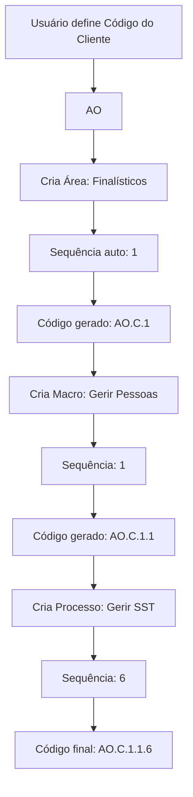

# 🔖 Sistema de Codificação Automática - Processos GRV

## 📋 Visão Geral

Foi implementado um sistema completo de **geração automática de códigos hierárquicos** para Áreas, Macroprocessos e Processos no módulo GRV (Gestão de Rotina e Valor).

### Estrutura do Código

```
{CÓDIGO_CLIENTE}.{TIPO}.{ÁREA}.{MACROPROCESSO}.{PROCESSO}
```

**Componentes:**
- **CÓDIGO_CLIENTE**: Código único da empresa (ex: AO, AB, AC, AD, FF)
- **TIPO**: C = Processos, J = Projetos
- **ÁREA**: Número sequencial da área (1, 2, 3...)
- **MACROPROCESSO**: Número sequencial do macro dentro da área (1, 2, 3...)
- **PROCESSO**: Número sequencial do processo dentro do macro (1, 2, 3...)

**Exemplos:**
- `AO.C.1` - Área 1 da empresa AO
- `AO.C.1.2` - Macroprocesso 2 da Área 1
- `AO.C.1.2.11` - Processo 11 do Macroprocesso 2 da Área 1

---

## ✅ Implementações Realizadas

### 1. **Banco de Dados** ✓

#### Adições à Tabela `companies`:
```sql
ALTER TABLE companies ADD COLUMN client_code TEXT;
```

#### Adições à Tabela `process_areas`:
```sql
ALTER TABLE process_areas ADD COLUMN code TEXT;
```

**Observação:** As tabelas `macro_processes` e `processes` já possuíam coluna `code`.

### 2. **Funções de Geração de Código** ✓

Implementadas em `database/sqlite_db.py`:

#### `_generate_area_code(company_id, area_id)`
Gera código para área baseado em:
- Código do cliente
- Tipo fixo: "C" (processos)
- order_index da área

**Retorna:** `AO.C.1`, `AO.C.2`, etc.

#### `_generate_macro_code(company_id, area_id, macro_id)`
Gera código para macroprocesso baseado em:
- Código da área (gerado pela função acima)
- order_index do macroprocesso

**Retorna:** `AO.C.1.2`, `AO.C.1.3`, etc.

#### `_generate_process_code(company_id, macro_id, process_id)`
Gera código completo para processo baseado em:
- Código do macroprocesso
- order_index do processo

**Retorna:** `AO.C.1.2.11`, `AO.C.1.2.12`, etc.

### 3. **Geração Automática ao Criar** ✓

As funções de criação foram atualizadas para:

1. **Calcular automaticamente o próximo `order_index`** se não for fornecido:
   - Áreas: próximo número global da empresa
   - Macros: próximo número dentro da área
   - Processos: próximo número dentro do macro

2. **Gerar código automaticamente após inserção** no banco

**Funções Modificadas:**
- `create_process_area()` → gera código da área
- `create_macro_process()` → gera código do macro
- `create_process()` → gera código do processo

### 4. **Ordenação por Código** ✓

Todas as listagens foram atualizadas para ordenar por código:

```python
# Antes
ORDER BY order_index, name

# Depois
ORDER BY code, order_index, name
```

**Funções Modificadas:**
- `list_process_areas()`
- `list_macro_processes()`
- `list_processes()`

### 5. **Interface - Código do Cliente** ✓

#### Dashboard GRV (`templates/routine_dashboard.html`)

Adicionada seção de configurações da empresa:
- Campo para definir o código do cliente
- Destaque visual com box colorido
- Explicação do formato de codificação
- Exemplo visual: `AO.C.1.2.11`
- Conversão automática para UPPERCASE
- Salvamento via API

**Localização:** Dashboard da empresa no GRV

### 6. **Interface - Macroprocessos** ✓

#### Página Dedicada (`templates/grv_process_macro.html`)

**Mudanças:**
- ✅ Removido campo manual de código
- ✅ Adicionado box explicativo de "Código Automático"
- ✅ Preview do formato do código
- ✅ Campo "Sequência/Ordem" obrigatório
- ✅ Explicação que a sequência é usada na geração do código

**Campos do Formulário:**
- Área de Gestão *
- **Sequência/Ordem * (novo destaque)**
- Nome do Macroprocesso *
- **Dono do Processo * (campo destacado)**
- Descrição

### 7. **Interface - Mapa de Processos** ✓

#### Template (`templates/grv_process_map.html`)

**Formulários Atualizados:**

**Macroprocessos:**
- Removido campo manual de código
- Adicionado campo "Sequência/Ordem"
- Destaque para "Dono do Processo"

**Processos:**
- Removido campo manual de código
- Adicionado campo "Sequência/Ordem"
- Mantidos campos de nível de estruturação e desempenho

### 8. **JavaScript Atualizado** ✓

#### `static/js/grv-macro-processes.js`
- Removida manipulação do campo `code`
- Validação do campo `order_index` (mínimo 1)
- Não envia mais o campo `code` no payload

---

## 🎯 Como Usar

### Passo 1: Configurar Código do Cliente

1. Acesse o **Dashboard da Empresa** no módulo GRV
2. Encontre a seção **"⚙️ Configurações da Empresa"**
3. Defina o **Código do Cliente** (ex: `AO`, `AB`, `FF`)
4. Clique em **"💾 Salvar Configurações"**

### Passo 2: Criar Área de Gestão

1. Acesse **"Mapa de Processos"**
2. Vá para a aba **"Áreas de Gestão"**
3. Preencha:
   - Nome da Área
   - Cor (opcional)
4. Deixe o campo "Ordem" vazio ou defina manualmente
5. Salve

**Código Gerado Automaticamente:** `{CLIENTE}.C.{SEQUÊNCIA}`  
Exemplo: `AO.C.1`

### Passo 3: Criar Macroprocesso

1. Acesse **"Macroprocessos"** (página dedicada ou aba no Mapa)
2. Clique em **"➕ Novo Macroprocesso"**
3. Preencha:
   - **Área de Gestão**
   - **Sequência/Ordem** (ex: 1, 2, 3...)
   - **Nome do Macroprocesso**
   - **Dono do Processo** (obrigatório)
   - Descrição (opcional)
4. Salve

**Código Gerado Automaticamente:** `{ÁREA}.{SEQUÊNCIA}`  
Exemplo: `AO.C.1.2`

### Passo 4: Criar Processo

1. Acesse **"Mapa de Processos"** → Aba **"Processos"**
2. Preencha:
   - **Macroprocesso**
   - **Nome do Processo**
   - **Sequência/Ordem** (ex: 1, 2, 11, 12...)
   - Níveis de estruturação e desempenho
   - Responsável (opcional)
3. Salve

**Código Gerado Automaticamente:** `{MACRO}.{SEQUÊNCIA}`  
Exemplo: `AO.C.1.2.11`

---

## 📊 Exemplos Práticos

### Empresa: Acme Org (Código: AO)

| Tipo | Nome | Sequência | Código Gerado |
|------|------|-----------|---------------|
| Área | Finalísticos | 2 | `AO.C.2` |
| Macro | Gerir Pessoas | 1 | `AO.C.2.1` |
| Processo | Gerir SST | 6 | `AO.C.2.1.6` |
| Processo | Gerir Treinamentos | 7 | `AO.C.2.1.7` |
| Macro | Gerir Vendas | 2 | `AO.C.2.2` |
| Processo | Prospectar Clientes | 1 | `AO.C.2.2.1` |
| Processo | Fechar Vendas | 2 | `AO.C.2.2.2` |

### Empresa: Fast Foods (Código: FF)

| Tipo | Nome | Sequência | Código Gerado |
|------|------|-----------|---------------|
| Área | Operações | 1 | `FF.C.1` |
| Macro | Atendimento | 1 | `FF.C.1.1` |
| Processo | Receber Pedido | 1 | `FF.C.1.1.1` |
| Processo | Preparar Pedido | 2 | `FF.C.1.1.2` |
| Processo | Entregar Pedido | 3 | `FF.C.1.1.3` |

---

## 🔄 Fluxo de Geração



---

## 💡 Vantagens do Sistema

### ✅ Automação Total
- Não precisa digitar códigos manualmente
- Reduz erros de digitação
- Garante consistência

### ✅ Hierarquia Clara
- Código reflete a estrutura organizacional
- Fácil identificar a hierarquia
- Navegação intuitiva

### ✅ Ordenação Perfeita
- Ordenação automática por código
- Sequência lógica no mapa de processos
- Facilita visualização

### ✅ Flexibilidade
- Sequência pode ter gaps (1, 2, 5, 10...)
- Permite reorganização futura
- Suporta diferentes numerações

### ✅ Escalabilidade
- Funciona com qualquer quantidade de processos
- Suporta múltiplas empresas
- Cada empresa tem seu código único

---

## 📁 Arquivos Modificados

### Banco de Dados:
1. `database/sqlite_db.py`
   - Adicionada coluna `client_code` em companies
   - Adicionada coluna `code` em process_areas
   - 6 funções novas de geração de código
   - 3 funções create atualizadas
   - 3 funções list atualizadas para ordenação

### Templates:
1. `templates/routine_dashboard.html` - Seção de configuração do código cliente
2. `templates/grv_process_macro.html` - Formulário sem campo manual de código
3. `templates/grv_process_map.html` - Formulários atualizados

### JavaScript:
1. `static/js/grv-macro-processes.js` - Removida lógica de código manual

### APIs:
1. `app_pev.py` - API update_company_profile atualizada (já estava funcional)

---

## 🧪 Como Testar

### Teste 1: Configurar Código do Cliente
1. Acesse o dashboard GRV de uma empresa
2. Configure o código (ex: `AO`)
3. Salve
4. Recarregue a página e verifique se o código está salvo

### Teste 2: Criar Área com Código Automático
1. Crie uma área no Mapa de Processos
2. Deixe "Ordem" vazio ou defina como 1
3. Salve
4. Verifique se o código foi gerado: `AO.C.1`

### Teste 3: Criar Macroprocesso
1. Crie um macroprocesso
2. Defina sequência como 1
3. Salve
4. Verifique código: `AO.C.1.1`

### Teste 4: Criar Processo Completo
1. Crie um processo
2. Defina sequência como 6
3. Salve
4. Verifique código completo: `AO.C.1.1.6`

### Teste 5: Ordenação
1. Crie vários processos com sequências: 1, 2, 5, 10
2. Visualize no mapa
3. Verifique se estão ordenados por código

### Teste 6: Múltiplas Áreas e Macros
1. Crie Área 1, Macro 1, Processo 1 → `AO.C.1.1.1`
2. Crie Área 1, Macro 2, Processo 1 → `AO.C.1.2.1`
3. Crie Área 2, Macro 1, Processo 1 → `AO.C.2.1.1`
4. Verifique se todos os códigos estão corretos

---

## 🎉 Status: IMPLEMENTAÇÃO COMPLETA

✅ Todas as funcionalidades foram implementadas com sucesso!  
✅ Sistema de codificação hierárquica totalmente automático!  
✅ Sem necessidade de digitação manual de códigos!  
✅ Ordenação automática por código!  
✅ Interface intuitiva e user-friendly!

---

**Data:** Outubro 2025  
**Projeto:** app25 - Módulo GRV  
**Feature:** Sistema de Codificação Automática Hierárquica
