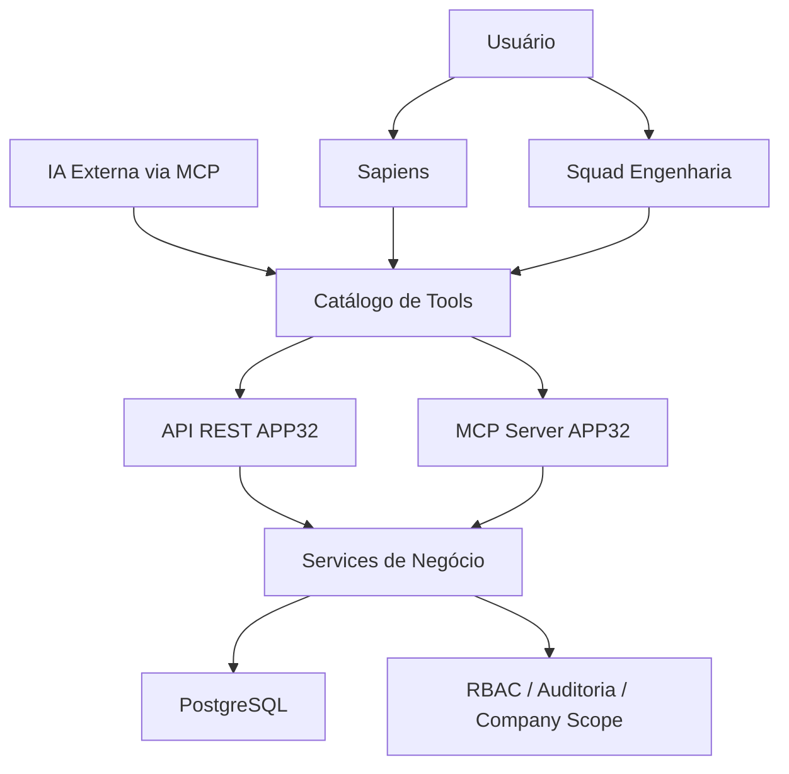

# Convergência Sapiens + Squad + MCP Tool-First

## Objetivo
Consolidar o APP32 em torno de duas interfaces centrais:

- **Sapiens**: hub generalista de negócio/operação
- **Squad de Engenharia**: hub técnico interno

E mover especializações para:

- **Services**
- **API REST**
- **MCP Tools**

## Princípios
- Não criar novos agentes de tela por domínio.
- Toda capacidade nova nasce em **service + REST + MCP**.
- Multi-tenancy obrigatório via `company_id`.
- RBAC e auditoria em toda ação sensível.
- Inferência intensiva pode ser deslocada para runtime do cliente via MCP.

## Inventário resumido das superfícies
| Superfície atual | Situação alvo |
|---|---|
| `/sapiens` | Hub principal de IA |
| `/agents/engineering` | Entrada do Squad de Engenharia |
| `/agents/planejamento` | Wrapper do Sapiens com contexto de planejamento |
| `/agents/processos` | Wrapper do Sapiens com contexto de processos |
| `/agents/rotina` | Wrapper do Sapiens com contexto operacional |
| `/agents/performance` | Wrapper do Sapiens com contexto de indicadores |
| `/agents/estrategico` | Wrapper do Sapiens com contexto executivo |
| `/agents/cadastro` | Onboarding assistido de empresa |
| `/companies/new` | Rota canônica do onboarding |

## Matriz tela atual → destino → tools
| Tela atual | Destino | Tools-alvo |
|---|---|---|
| Planejamento | Wrapper do Sapiens | `generate_strategy_snapshot`, `suggest_okrs`, `list_strategic_gaps` |
| Processos | Wrapper do Sapiens | `list_processes`, `map_process`, `analyze_process_bottlenecks` |
| Rotina | Wrapper do Sapiens | `list_pending_tasks`, `summarize_team_workload`, `generate_followup_actions` |
| Performance | Wrapper do Sapiens | `list_indicators`, `analyze_indicator_trends`, `detect_performance_risk` |
| Estratégico | Wrapper do Sapiens | `generate_executive_summary`, `compare_strategy_vs_execution`, `list_strategic_risks` |
| Cadastro | Onboarding | `create_company`, `analyze_company_completeness`, `continue_company_onboarding` |

## Arquitetura alvo

## Resultado esperado
- Menos telas-agente
- Menos prompt spaghetti
- Mais governança
- Mais reaproveitamento de services
- Custo de IA mais previsível

## Publicação canônica do catálogo tool-first
- **REST**: `/api/configs/ai/mcp/tool-first-catalog`
- **Console**: `/configs/ai/mcp`
- **Frontend state**: `/api/configs/ai/mcp/frontend-state`
- **MCP discovery**: `list_app32_capabilities`

### Filtros REST suportados
- `domain=engineering,strategy,...`
- `status=canonical,wrapper`
- `surface=engineering,sapiens,onboarding`
- `include_backlog=true|false`

O contrato REST do catálogo tool-first organiza os domínios em:
- onboarding de empresa
- planejamento estratégico
- processos
- rotina operacional
- performance
- leitura executiva
- squad de engenharia

Cada domínio passa a declarar:
- rota legada/wrapper
- rota canônica
- contratos REST ativos
- contratos MCP publicados
- backlog de tools planejadas
- notas de governança
