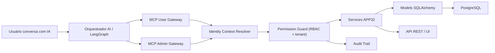

# Integração de IAs com APP32 via MCP

## Objetivo

Permitir que uma IA converse com o APP32 e execute operações de negócio como um **usuário programático autenticado**, respeitando:

- multi-tenancy obrigatório por `company_id`;
- RBAC idêntico ao da aplicação web;
- mesmas regras da Layer 3 (`services/`);
- auditoria completa;
- separação entre superfície de negócio e superfície administrativa.

---

## Decisão Arquitetural

### Diretriz principal

Não criar lógica paralela para a IA.

Toda operação deve seguir:

`Prompt -> Tool MCP -> Service APP32 -> Models/DB`

### Estrutura recomendada

- **1 núcleo de negócio compartilhado**
  - `services/`
  - `models/`
  - validações/schemas
- **2 superfícies MCP**
  - `user-mcp`: ferramentas de negócio
  - `admin-mcp`: ferramentas técnicas/operacionais

### Regra de ouro

As duas superfícies usam o mesmo core.  
O que muda é apenas:

- catálogo de tools expostas;
- política de autenticação/autorização;
- nível de auditoria e confirmação.

---

## Arquitetura proposta



---

## Mapeamento com o APP32 atual

### Peças já existentes

- MCP server base:
  - `C:\GestaoVersus\app32\src\core\mcp_server.py`
- contexto unificado de identidade:
  - `C:\GestaoVersus\app32\src\intelligence\tool_context.py`
- regras gerais de tools:
  - `C:\GestaoVersus\app32\src\intelligence\tools.py`
- RBAC web atual:
  - `C:\GestaoVersus\app32\utils\permissions.py`
- vínculo usuário x empresa:
  - `C:\GestaoVersus\app32\models\employee.py`
- papel/permissões por empresa:
  - `C:\GestaoVersus\app32\models\role.py`
- entidade de projeto:
  - `C:\GestaoVersus\app32\models\project.py`

### Gap principal atual

O APP32 já possui base MCP, contexto e regras.  
O próximo passo é formalizar:

1. **schemas Pydantic de entrada/saída**;
2. **guards reutilizáveis para tenant + RBAC**;
3. **services explícitos para comandos de negócio via IA**;
4. **auditoria dedicada de execução MCP/AI**.

---

## Estratégia de autenticação

## Perfil 1: MCP de Usuário

Uso: operação normal do sistema.

### Recomendação

Autenticar cada sessão MCP com um usuário real do APP32:

- `user_id`
- empresas vinculadas via `employees`
- `company_id` ativo
- `employee_id` no tenant
- canal (`web`, `telegram`, `whatsapp`, `api`, `mcp`)
- `thread_id`

### Modelo

A sessão MCP deve estabelecer o contexto com algo conceitualmente equivalente a:

```python
set_sapiens_context(
    user_id=123,
    company_id=7,
    employee_id=456,
    channel="mcp",
    thread_id="chat-abc-123",
    metadata={"auth_mode": "user_token"}
)
```

### Regra

Se o usuário não tiver vínculo com a empresa, a tool falha.  
Se tiver vínculo mas não possuir permissão, a tool falha.  
Se houver ambiguidade de empresa, a tool pede desambiguação ou usa a empresa ativa da sessão.

---

## Perfil 2: MCP Admin/Dev

Uso: diagnóstico, suporte, observabilidade, manutenção.

### Recomendação

Servidor MCP separado, com autenticação distinta e catálogo reduzido.

Exemplos de tools:

- `get_system_health`
- `get_database_schema`
- tools de troubleshooting

### Regra

Esse servidor **não** deve ser usado para rotina de negócio.

---

## Política de permissões

Basear o MCP de usuário em `C:\GestaoVersus\app32\utils\permissions.py`.

### Regras

1. usuário precisa estar autenticado;
2. usuário precisa ter acesso ao `company_id`;
3. ação precisa respeitar `resource/action`;
4. para projeto, usar:
   - `resource = "projects"`
   - `action = "view" | "create" | "edit"`

### Exemplo

Para `create_project`, a checagem mínima é:

```python
has_permission(company_id, "projects", "create")
```

### Observação importante

Nunca confiar apenas no `company_id` recebido no payload.  
Ele deve ser validado contra o contexto do usuário e contra a tabela `employees`.

---

## Contrato padrão das tools MCP

## Convenções

- nomes em `snake_case`;
- input via Pydantic com `extra='forbid'`;
- output estruturado;
- erros previsíveis e auditáveis;
- nada de SQL de escrita na tool.

## Envelope de resposta recomendado

```json
{
  "success": true,
  "data": {},
  "message": "Projeto criado com sucesso.",
  "meta": {
    "company_id": 7,
    "executed_as_user_id": 123,
    "origin": "mcp_ai"
  }
}
```

## Envelope de erro recomendado

```json
{
  "success": false,
  "error": {
    "code": "PERMISSION_DENIED",
    "message": "Usuário não possui permissão para criar projetos nesta empresa."
  }
}
```

---

## Catálogo inicial de tools MCP de usuário

### Leitura

- `list_my_companies`
- `get_active_company`
- `list_projects`
- `get_project`
- `list_project_tasks`
- `list_my_work`

### Escrita

- `create_project`
- `update_project`
- `create_project_task`
- `update_project_task`
- `change_project_status`

### Sensíveis com human gate

- `delete_project`
- `cancel_project`
- `bulk_update_project_tasks`

---

## Schemas propostos

## 1. Resolução de empresa

```python
from pydantic import BaseModel, ConfigDict
from typing import Optional

class CompanyRefInput(BaseModel):
    model_config = ConfigDict(extra="forbid")

    company_id: Optional[int] = None
    company_name: Optional[str] = None
```

## 2. Create Project

```python
from pydantic import BaseModel, ConfigDict, Field
from typing import Optional, Literal, List
from datetime import date

class CreateProjectInput(BaseModel):
    model_config = ConfigDict(extra="forbid")

    company_id: Optional[int] = None
    company_name: Optional[str] = None
    title: str = Field(min_length=3, max_length=200)
    description: Optional[str] = None
    owner: Optional[str] = Field(default=None, max_length=200)
    priority: Literal["low", "medium", "high"] = "medium"
    status: Literal["planned", "in_progress", "completed", "cancelled"] = "planned"
    deadline: Optional[date] = None
    budget: Optional[str] = Field(default=None, max_length=100)
    plan_id: Optional[int] = None
    portfolio_id: Optional[int] = None
    okr_links: Optional[List[int]] = None
    kpis: Optional[List[str]] = None
```

## 3. Create Project Output

```python
class CreateProjectOutput(BaseModel):
    model_config = ConfigDict(extra="forbid")

    id: int
    code: str
    company_id: int
    name: str
    status: str
    priority: str
    deadline: Optional[str] = None
    message: str
```

---

## Fluxo técnico de `create_project`

## Sequência

1. IA recebe:  
   “Crie um projeto novo na empresa GanduInvest com título X...”

2. tool MCP `create_project` recebe payload estruturado.

3. schema Pydantic valida.

4. resolver de tenant identifica empresa:
   - se veio `company_id`, valida vínculo;
   - se veio `company_name`, busca apenas entre empresas acessíveis pelo usuário;
   - se não veio nada, usa `company_id` do contexto ativo.

5. guard de autorização executa:
   - `can_access_company(company_id)`
   - `has_permission(company_id, "projects", "create")`

6. service de negócio cria projeto usando `Project` e regras centrais.

7. auditoria registra execução.

8. retorno estruturado com `id`, `code`, `company_id`.

---

## Service recomendado

Criar um service explícito para comando de projeto via IA/API.

### Arquivo sugerido

- `C:\GestaoVersus\app32\services\project_command_service.py`

### Responsabilidades

- validar tenant;
- validar permissão;
- validar referências opcionais (`plan_id`, `portfolio_id`);
- criar projeto;
- registrar auditoria;
- retornar DTO estável.

### Assinatura sugerida

```python
class ProjectCommandService:
    @staticmethod
    def create_project(*, actor_user_id: int, company_id: int, payload: CreateProjectInput):
        ...
```

### Regras internas

- sempre preencher `Project.company_id` pelo tenant validado;
- nunca usar `company_id` sem checagem de acesso;
- rollback em qualquer falha;
- retorno em formato serializável.

---

## Tool MCP recomendada

### Arquivo sugerido

- `C:\GestaoVersus\app32\src\core\mcp_project_tools.py`

### Responsabilidade

Camada fina.  
Só deve:

1. receber input;
2. validar schema;
3. obter contexto do usuário;
4. chamar service;
5. devolver resposta.

### Pseudocódigo

```python
@mcp.tool()
def create_project(payload: dict) -> dict:
    identity = get_sapiens_context()
    if not identity.user_id:
        return {"success": False, "error": {"code": "UNAUTHENTICATED", "message": "Sessão MCP sem usuário."}}

    parsed = CreateProjectInput.model_validate(payload)
    result = ProjectCommandService.create_project(
        actor_user_id=identity.user_id,
        company_id=resolve_company_id(identity=identity, payload=parsed),
        payload=parsed,
    )
    return {"success": True, "data": result, "message": "Projeto criado com sucesso."}
```

---

## Resolver de empresa

Criar um componente comum para toda tool multi-tenant.

### Arquivo sugerido

- `C:\GestaoVersus\app32\services\tenant_context_service.py`

### Responsabilidades

- listar empresas acessíveis do usuário;
- resolver empresa por `company_id`;
- resolver empresa por nome/código;
- decidir empresa ativa default;
- impedir cross-tenant.

### Regra de matching

O nome informado no prompt deve ser comparado **somente** contra empresas que o usuário já acessa.

Nunca fazer busca global e depois autorizar.

---

## Auditoria obrigatória

## Proposta de tabela

`ai_mcp_audit_log`

### Campos

- `id`
- `created_at`
- `user_id`
- `employee_id`
- `company_id`
- `thread_id`
- `channel`
- `tool_name`
- `operation`
- `request_payload_json`
- `response_payload_json`
- `status`
- `error_code`
- `error_message`
- `origin` (`mcp_ai`)

### Objetivo

Permitir rastrear:

- quem pediu;
- em qual empresa;
- qual tool executou;
- qual dado entrou;
- qual dado saiu;
- se houve bloqueio de segurança.

---

## Human Gate para ações sensíveis

Algumas ações não devem executar em um único passo.

### Padrão

1. IA prepara comando;
2. retorna resumo da operação;
3. usuário confirma;
4. tool executa com `confirmation_token`.

### Ações candidatas

- exclusão;
- cancelamento irreversível;
- aprovações financeiras;
- mudanças em lote;
- alteração de permissões.

---

## Contrato conversacional sugerido

### Exemplo 1

Usuário:

> Crie um projeto novo na empresa GanduInvest com título Implantação do Financeiro, prazo 2026-05-10 e prioridade alta.

### Orquestração

1. IA detecta intenção `create_project`
2. monta payload estruturado
3. chama `create_project`
4. devolve:

> Projeto criado com sucesso na empresa GanduInvest.  
> Código: GANDU.J.123  
> Status: planned  
> Prazo: 2026-05-10

### Exemplo 2: ambiguidade

> Encontrei mais de uma empresa compatível com “Gandu”. Informe a empresa exata.

---

## Fases de implementação

## Fase 1 — Fundação

- criar schemas Pydantic para tools MCP;
- criar `tenant_context_service.py`;
- criar `permission_service`/adapter para MCP;
- criar `project_command_service.py`;
- criar `mcp_project_tools.py`;
- registrar no `src/core/mcp_server.py`.

## Fase 2 — Auditoria

- migration para `ai_mcp_audit_log`;
- hook padrão de auditoria para tools de escrita;
- correlação por `thread_id`.

## Fase 3 — Human Gate

- fluxo de confirmação;
- expiração de confirmação;
- bloqueio de replay.

## Fase 4 — Expansão de domínio

- tarefas de projeto;
- processos;
- reuniões;
- financeiro com gates reforçados.

---

## Critérios de aceite

Uma integração MCP de negócio só pode ser considerada pronta quando:

- toda tool relevante validar input com Pydantic;
- toda operação respeitar `company_id`;
- toda escrita passar por service da Layer 3;
- RBAC do MCP for o mesmo da web;
- houver auditoria completa;
- testes cobrirem sucesso, permissão negada e cross-tenant;
- nenhuma tool de usuário expuser superfície administrativa.

---

## Primeiro recorte recomendado para execução

### Escopo inicial

1. `list_my_companies`
2. `get_active_company`
3. `create_project`
4. `list_projects`

### Motivo

Esse recorte já permite o caso de uso real:

> “Crie um projeto novo na empresa GanduInvest...”

com segurança, governança e baixo risco arquitetural.

