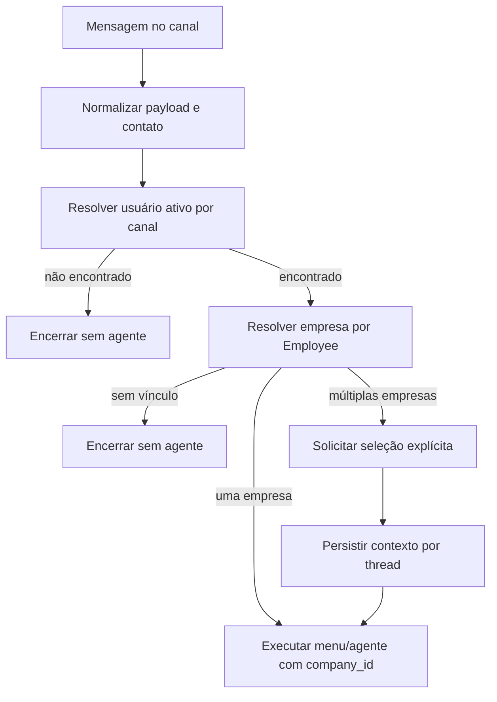

# Plano final — Fluxo Sapiens WhatsApp/Instagram com empresas vinculadas

## Resultado da auditoria AA.J.31.1497–1500

A auditoria confirmou os entrypoints, formalizou rastreabilidade de identidade e endureceu a resolução de empresa para eliminar fallback global de tenant. O fluxo mínimo seguro passa a ser:

## Decisões técnicas

- `company_id` é obrigatório para menu, agente e ferramentas.
- A fronteira de empresa é o vínculo `Employee` do usuário; não há fallback para primeira empresa ativa.
- A seleção automática atual continua determinística, mas a evolução recomendada é perguntar a empresa quando houver múltiplas empresas ativas.
- Logs de trace devem continuar sem transportar objeto de domínio inteiro.

## Backlog recomendado

1. Criar armazenamento de contexto de canal/thread para seleção temporária de empresa.
2. Adicionar interceptador de seleção/troca de empresa antes do menu operacional.
3. Exigir confirmação de ações sensíveis quando a intenção for mutação.
4. Expor observabilidade de falhas por motivo de identidade/empresa.

## Critérios de regressão

- Testes de contrato devem falhar se `Company.query` voltar para a resolução de empresa do Sapiens.
- Testes de entrypoint devem falhar se o blueprint/rotas mudarem sem atualizar auditoria.
- Testes de identidade devem cobrir variantes WhatsApp/Instagram para evitar regressão na identificação.
