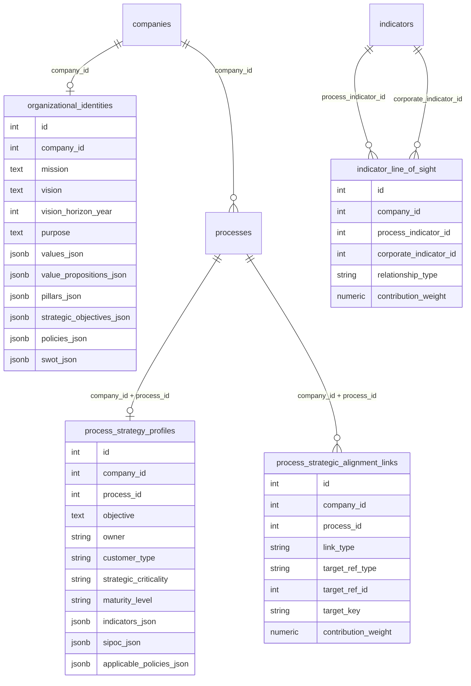

# SPEC — Sapiens Engenharia: Alinhamento Estratégico N1

Classe documental: **SPEC**
Status: **oficial — MVP técnico / ciclo conjunto com consultoria**
Data: **2026-05-31**
Piloto: **Save Water (`company_id = 1`)**

## 1. Decisão executiva

A plataforma passa a suportar a capacidade **Strategic Alignment N1** para cruzar:

- **Identidade Organizacional estruturada**;
- **Arquitetura de Processos**;
- **Rastreabilidade estratégica** entre processos, objetivos, pilares, proposta de valor, diferenciais, competências, políticas e indicadores.

Contrato canônico:

- `analysis_id`: `strategic_alignment_n1`
- `read_model`: `strategic.alignment_n1`
- Tool analítica canônica: `analyze_strategic_alignment_n1_tool`
- Alias de compatibilidade: `run_strategy_alignment_n1_analysis_tool`

## 2. Modelo de colaboração Claude × Engenharia

| Frente | Responsável | Decisão |
|---|---|---|
| Necessidade de negócio, benchmarks, perguntas ao cliente e validação consultiva | Cliente/Consultor via Claude | Claude pode seguir em paralelo. |
| Schema, segurança, multi-tenancy, MCP, performance, análise e QA | Squad Engenharia + CEO Consultoria | Engenharia decide viabilidade e implementação. |
| Pontos de trade-off | Ambos | Registrar em SPEC/backlog antes de expandir escopo. |

## 3. Parecer de viabilidade do MVP-N1

Viável com arquitetura **sidecar tenant-safe**, sem mutar imediatamente tabelas legadas críticas (`processes`, `indicators`, `okrs_*`) além de leitura/reuso.

### Por que sidecar no MVP

- evita migração disruptiva em entidades centrais já usadas por rotina, indicadores e OKRs;
- permite rastreabilidade C1–C5 por `company_id` com FKs compostas;
- preserva legados `companies.mvv_*` como fallback, mas cria identidade estruturada canônica;
- reduz risco de drift enquanto Claude valida o modelo consultivo real com cliente.

### O que fica para normalização v2

- `organization_values`, `strategic_pillars`, `organizational_policies`, `core_competencies` como tabelas normalizadas;
- `okrs_global.pillar_id` / `okrs_area.pillar_id`;
- `indicators.parent_indicator_id` e `indicators.strategic_objective_id`;
- CRUD MCP completo de indicadores, se a governança de indicadores confirmar o modelo.

## 4. Entidades oficiais do MVP

| Entidade | Tabela | Escopo tenant | Função |
|---|---|---|---|
| Identidade Organizacional | `organizational_identities` | `company_id` único | Guarda identidade estruturada A1–A14. |
| Perfil estratégico do processo | `process_strategy_profiles` | `company_id + process_id` | Complementa processo com B1–B10. |
| Vínculos de alinhamento | `process_strategic_alignment_links` | `company_id + process_id` | Ponte C1–C4 e parte de C2/C3. |
| Linha de visada de indicadores | `indicator_line_of_sight` | `company_id + indicadores` | Ponte C5. |

## 5. Diagrama ER

## 6. Segurança, tenancy e LGPD

- Todo acesso exige `company_id` explícito.
- FKs compostas protegem vínculo filho contra troca de tenant:
  - `process_strategy_profiles(company_id, process_id) → processes(company_id, id)`;
  - `process_strategic_alignment_links(company_id, process_id) → processes(company_id, id)`;
  - `indicator_line_of_sight(company_id, indicator_id) → indicators(company_id, id)`.
- Mutação estratégica tem `human_gate=True` nas capabilities.
- Surface analítica é somente leitura: `analytics`.
- Dados estratégicos são sensíveis de negócio: sem SQL livre, sem cross-tenant, sem exposição financeira sensível em surface `user`.

## 7. Performance e custo de query

Índices MVP:

- `organizational_identities(company_id)`;
- `process_strategy_profiles(company_id, process_id)`;
- `process_strategic_alignment_links(company_id, process_id)`;
- `process_strategic_alignment_links(company_id, link_type)`;
- `process_strategic_alignment_links(company_id, target_ref_type, target_ref_id, target_key)`;
- `indicator_line_of_sight(company_id, process_indicator_id)`;
- `indicator_line_of_sight(company_id, corporate_indicator_id)`.

O read model N1 é adequado para piloto e empresas médias. Para empresas com milhares de processos/indicadores, evoluir para materialização/cache do `strategic.alignment_n1`.

## 8. Tools MCP oficiais

### Identidade

| Tool | Tipo | Entrada mínima | Observação |
|---|---|---|---|
| `get_organizational_identity_tool` | leitura | `company_id` | Canônica consultiva. |
| `upsert_organizational_identity_tool` | escrita | `company_id`, `payload`, `user_id?` | Atualiza identidade estruturada e sincroniza MVV legado quando aplicável. |
| `get_strategy_identity_tool` | leitura | `company_id` | Alias legado/engenharia. |
| `upsert_strategy_identity_tool` | escrita | `company_id`, `payload`, `user_id?` | Alias legado/engenharia. |

### Perfil estratégico do processo

| Tool | Tipo | Entrada mínima | Observação |
|---|---|---|---|
| `get_process_strategic_profile_tool` | leitura | `company_id`, `process_id` | Canônica consultiva. |
| `upsert_process_strategic_profile_tool` | escrita | `company_id`, `process_id`, `payload`, `user_id?` | Objetivo, dono, cliente, criticidade, maturidade, SIPOC e políticas. |
| `get_process_strategy_profile_tool` | leitura | `company_id`, `process_id` | Alias legado/engenharia. |
| `upsert_process_strategy_profile_tool` | escrita | `company_id`, `process_id`, `payload`, `user_id?` | Alias legado/engenharia. |

### Ponte C1–C4

| Tool | Tipo | Entrada mínima |
|---|---|---|
| `list_process_strategy_alignment_links_tool` | leitura | `company_id`, `process_id?` |
| `upsert_process_strategy_alignment_link_tool` | escrita | `company_id`, `payload`, `user_id?` |
| `delete_process_strategy_alignment_link_tool` | escrita | `company_id`, `link_id` |

`link_type` permitido:

- `strategic_objective`
- `strategic_pillar`
- `value_proposition`
- `differential`
- `essential_competence`
- `policy`

### Ponte C5

| Tool | Tipo | Entrada mínima |
|---|---|---|
| `list_indicator_line_of_sight_tool` | leitura | `company_id`, `process_id?` |
| `upsert_indicator_line_of_sight_tool` | escrita | `company_id`, `payload`, `user_id?` |
| `delete_indicator_line_of_sight_tool` | escrita | `company_id`, `link_id` |

### Readiness e análise

| Tool | Tipo | Entrada mínima | Contrato |
|---|---|---|---|
| `get_strategic_alignment_n1_readiness_tool` | análise/leitura | `company_id` | Canônica consultiva. |
| `analyze_strategic_alignment_n1_tool` | análise/leitura | `company_id` | Canônica consultiva. |
| `get_strategy_alignment_n1_readiness_tool` | análise/leitura | `company_id` | Alias de compatibilidade. |
| `run_strategy_alignment_n1_analysis_tool` | análise/leitura | `company_id` | Alias de compatibilidade. |

## 9. Saída mínima do read model

O payload retorna:

- `summary`;
- `gaps`;
- `crossings`;
- `recommended_actions`.

Gaps mínimos:

- `objectives_without_process`;
- `processes_without_objective`;
- `processes_without_purpose`;
- `pillars_without_process`;
- `value_propositions_without_process`;
- `differentials_without_process`;
- `essential_competencies_without_process`;
- `policies_without_process`;
- `values_without_policy`;
- `process_indicators_without_corporate`.

## 10. Backlog técnico priorizado

| Prioridade | Item | Estimativa | Risco |
|---|---|---:|---|
| P0 | Aplicar migration e smoke MCP no ambiente alvo | P | Baixo |
| P0 | Popular Save Water via tools canônicas | M | Médio — depende do cliente/consultor |
| P0 | Executar `analyze_strategic_alignment_n1_tool(company_id=1)` | P | Baixo |
| P1 | Enriquecer `list_process_hierarchy` com perfil estratégico opcional | M | Médio — impacto em contrato existente |
| P1 | CRUD MCP de indicadores/linhagem completa | G | Médio/alto — governança de indicadores |
| P1 | Normalizar identidade em tabelas próprias | G | Médio — migração de dados estruturados |
| P2 | Materializar/cache do read model | M | Baixo/médio — só necessário em escala |
| P2 | UI para mapa N1 | G | Médio — depende da validação do modelo consultivo |

## 11. Não recomendado no MVP

- Adicionar `processes.objective` agora: risco de acoplamento com telas/serviços legados; usar `process_strategy_profiles.objective`.
- Adicionar `indicators.parent_indicator_id` agora: pode conflitar com `indicator_tree` e com hierarquia corporativa existente; usar `indicator_line_of_sight`.
- Criar tabelas normalizadas para todos os itens de identidade antes da validação da Save Water: alto custo de retrabalho se o benchmark/cliente mudar a taxonomia.
- Publicar mutação estratégica na surface `analytics`: viola segregação de análise/leitura.

## 12. Próximo ciclo conjunto

Claude/consultoria pode seguir em paralelo com:

1. benchmark e perguntas de identidade Save Water;
2. preenchimento inicial de missão, visão, valores, pilares, objetivos, políticas e diferenciais;
3. sugestão de vínculos C1–C5.

Engenharia deve seguir com:

1. aplicar migration;
2. validar tools MCP no runtime real;
3. carregar dados piloto;
4. entregar o primeiro mapa `strategic_alignment_n1`.
