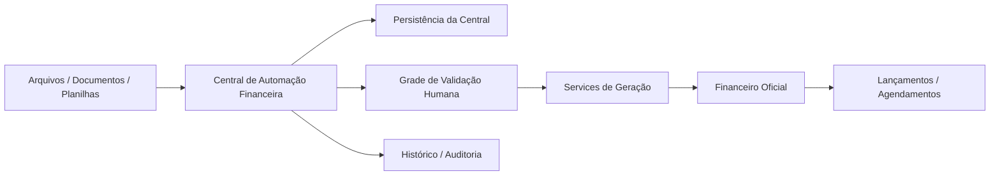

# Central de Automação Financeira — Backlog Implementável, Desenho Técnico e Plano de MVP

## 1. Objetivo deste documento

Consolidar a visão de implementação da **Central de Automação Financeira**, detalhando:

1. backlog implementável da **Etapa 1**;
2. desenho técnico da solução (backend, frontend, persistência e integração);
3. plano de MVP por fases;
4. relação direta com os cards do projeto `AA.J.31 (Produção)`.

Este documento complementa a especificação funcional em:

`C:\GestaoVersus\app32\app32\docs\specifications\central_automacao_financeira_v1.md`

---

## 2. Cards já criados no AA.J.31 (Produção)

A **Etapa 1** já foi materializada nos seguintes cards:

- `AA.J.31.1464` — `[Central de Automação Financeira — Etapa 1 - Passo 1 de 4]`
- `AA.J.31.1465` — `[Central de Automação Financeira — Etapa 1 - Passo 2 de 4]`
- `AA.J.31.1466` — `[Central de Automação Financeira — Etapa 1 - Passo 3 de 4]`
- `AA.J.31.1467` — `[Central de Automação Financeira — Etapa 1 - Passo 4 de 4]`

### Mapeamento funcional
- **Passo 1**: modelagem de persistência e contratos;
- **Passo 2**: services e APIs;
- **Passo 3**: tela operacional principal;
- **Passo 4**: integração final com Financeiro oficial, histórico e exclusão controlada.

---

## 3. Visão de solução

A solução será uma **camada externa ao Financeiro atual**, com boundary explícito.

### Papel da Central
- receber entradas automáticas;
- extrair e estruturar dados;
- permitir validação humana em lote;
- gerar lançamentos/agendamentos no Financeiro oficial;
- manter rastreabilidade e histórico.

### Papel do Financeiro oficial
- manter os registros financeiros oficiais;
- controlar liquidação, conciliação, dashboard e relatórios;
- receber apenas itens já validados pela Central.

---

## 4. Backlog implementável — Etapa 1

## 4.1 Passo 1 de 4 — Persistência e contratos
**Card:** `AA.J.31.1464`

### Objetivo
Criar a base de dados e os contratos de backend da Central.

### Entregas
1. modelagem das entidades centrais;
2. migrations da nova estrutura;
3. schemas de entrada e saída;
4. enums/status padronizados;
5. vínculo com `company_id` em toda a camada.

### Entidades conceituais mínimas
#### `financial_automation_batches`
Representa o lote de importação.

Campos sugeridos:
- `id`
- `company_id`
- `origin_type`
- `source_label`
- `created_by_user_id`
- `status_summary_json`
- `metadata_json`
- `created_at`
- `updated_at`
- `deleted_at`

#### `financial_automation_records`
Representa cada registro importado e revisável.

Campos sugeridos:
- `id`
- `company_id`
- `batch_id`
- `status` (`imported`, `validated`, `generated`, `excluded`)
- `entry_direction` (`payable`, `receivable`)
- `settlement_state` (`settled`, `open`)
- `description`
- `counterparty_id`
- `bank_account_id`
- `chart_account_id`
- `cost_center_id`
- `domain_type` (`project`, `process`)
- `domain_source_id`
- `amount`
- `competence_date`
- `due_date`
- `confidence_score`
- `source_document_id`
- `normalized_payload_json`
- `validation_notes`
- `generated_financial_entry_id`
- `generated_financial_schedule_id`
- `validated_by_user_id`
- `validated_at`
- `generated_by_user_id`
- `generated_at`
- `metadata_json`
- `created_at`
- `updated_at`
- `deleted_at`

#### `financial_automation_documents`
Representa os arquivos/documentos origem.

Campos sugeridos:
- `id`
- `company_id`
- `batch_id`
- `file_name`
- `stored_relative_path`
- `mime_type`
- `file_size`
- `sha256`
- `extracted_text`
- `preview_payload_json`
- `metadata_json`
- `created_at`
- `updated_at`
- `deleted_at`

#### `financial_automation_history`
Trilha de auditoria operacional da Central.

Campos sugeridos:
- `id`
- `company_id`
- `record_id`
- `action_type`
- `performed_by_user_id`
- `payload_before_json`
- `payload_after_json`
- `metadata_json`
- `created_at`

### Arquivos prováveis
- `C:\GestaoVersus\app32\app32\models\financial_automation.py`
- `C:\GestaoVersus\app32\app32\schemas\financial_automation.py`
- `C:\GestaoVersus\app32\app32\migrations\versions\<nova_migration>.py`

### Critérios de aceite do passo
- tabelas criadas com `company_id`;
- status restritos ao conjunto oficial;
- vínculo com lote/documento funcional;
- contracts de schema definidos.

---

## 4.2 Passo 2 de 4 — Services e APIs
**Card:** `AA.J.31.1465`

### Objetivo
Criar a camada determinística de negócio e os endpoints da Central.

### Serviços sugeridos
#### `FinancialAutomationIngestionService`
Responsável por:
- criar lote;
- receber arquivos;
- estruturar documentos;
- produzir registros importados;
- pré-validar campos.

#### `FinancialAutomationRecordService`
Responsável por:
- listar registros;
- editar campos da grade;
- alterar status;
- aplicar ações em lote;
- validar consistência mínima do item.

#### `FinancialAutomationGenerationService`
Responsável por:
- selecionar registros `validated`;
- gerar lançamentos/agendamentos no Financeiro oficial;
- evitar duplicidade;
- gravar vínculo de rastreabilidade;
- atualizar status para `generated`.

#### `FinancialAutomationHistoryService`
Responsável por:
- auditar alterações;
- expor histórico;
- suportar rastreabilidade e análise posterior.

### Endpoints sugeridos
#### Ingestão
- `POST /api/financial/automation/batches`
- `POST /api/financial/automation/batches/<batch_id>/documents`

#### Grade / registros
- `GET /api/financial/automation/records`
- `GET /api/financial/automation/records/<record_id>`
- `PUT /api/financial/automation/records/<record_id>`
- `POST /api/financial/automation/records/bulk-update`
- `POST /api/financial/automation/records/bulk-status`

#### Geração
- `POST /api/financial/automation/generate`

#### Histórico / origem
- `GET /api/financial/automation/batches`
- `GET /api/financial/automation/history`
- `GET /api/financial/automation/documents/<document_id>`

### MCP (fase opcional posterior, não bloqueante para MVP)
- `list_financial_automation_records`
- `update_financial_automation_record`
- `generate_validated_financial_automation_records`

### Arquivos prováveis
- `C:\GestaoVersus\app32\app32\services\financial_automation_ingestion_service.py`
- `C:\GestaoVersus\app32\app32\services\financial_automation_record_service.py`
- `C:\GestaoVersus\app32\app32\services\financial_automation_generation_service.py`
- `C:\GestaoVersus\app32\app32\services\financial_automation_history_service.py`
- `C:\GestaoVersus\app32\app32\api\resources\financial_automation.py`
- `C:\GestaoVersus\app32\app32\api\routes\financial_automation.py`

### Critérios de aceite do passo
- APIs com escopo por `company_id`;
- edição e atualização em lote operando;
- geração chamando contratos oficiais do Financeiro;
- histórico mínimo registrado.

---

## 4.3 Passo 3 de 4 — Tela principal da grade operacional
**Card:** `AA.J.31.1466`

### Objetivo
Entregar a interface operacional da Central.

### Tela principal
#### Rota sugerida
- `/financial/automation`

### Componentes mínimos
#### Cabeçalho
- título da Central;
- resumo do lote/resultado;
- atalhos de importação;
- ações principais.

#### Área de filtros
- status;
- origem;
- data de importação;
- período de competência;
- período de vencimento;
- lote;
- favorecido;
- apenas gerados / apenas excluídos.

#### Grade operacional
Colunas mínimas:
- seleção;
- status;
- origem;
- data da importação;
- tipo do item;
- situação do item;
- descrição;
- favorecido;
- valor;
- competência;
- vencimento;
- conta bancária;
- plano de contas;
- centro de resultado;
- projeto/processo;
- confiança;
- visualizar origem;
- editar detalhe.

#### Barra de ações em lote
- marcar como validada;
- marcar como excluída;
- aplicar alteração comum;
- gerar validados.

#### Modal/popup de origem
- PDF/imagem/documento;
- texto extraído;
- preview estruturado da planilha;
- payload bruto, quando aplicável.

### Arquivos prováveis
- `C:\GestaoVersus\app32\app32\templates\modules\financial\automation_center.html`
- `C:\GestaoVersus\app32\app32\static\js\financial_automation_center.js`
- `C:\GestaoVersus\app32\app32\static\css\financial_automation_center.css`
- `C:\GestaoVersus\app32\app32\api\routes\financial_automation.py`

### Critérios de aceite do passo
- grade renderiza com filtros e paginação;
- edição inline funciona nos campos-chave;
- ações em lote funcionam;
- visualização da origem abre sem sair da tela.

---

## 4.4 Passo 4 de 4 — Geração, histórico e exclusão controlada
**Card:** `AA.J.31.1467`

### Objetivo
Fechar a integração com o Financeiro oficial e garantir segurança operacional.

### Entregas
1. geração somente de registros `validated`;
2. vínculo entre item da Central e item oficial gerado;
3. bloqueio contra geração duplicada indevida;
4. histórico consultável;
5. exclusão controlada antes da geração;
6. regras de proteção para evolução futura de reversão.

### Regra de geração
- `já pago / já recebido` → gera item com liquidação, quando aplicável;
- `em aberto` → gera item pendente conforme contrato oficial do Financeiro.

### Regra de exclusão
- apenas registros ainda não gerados podem ir para fluxo simples de exclusão;
- registros gerados exigem trilha própria e nunca exclusão cega;
- toda exclusão deve ser auditada.

### Critérios de aceite do passo
- item gerado vinculado ao `record_id` da Central;
- histórico mostra importação, edição, validação, geração e exclusão;
- registros excluídos saem do fluxo de geração;
- segurança multi-tenant preservada.

---

## 5. Desenho técnico da solução

## 5.1 Arquitetura lógica

## 5.2 Camadas

### Camada de apresentação
- rotas HTML/Jinja da Central;
- grade operacional;
- modais de origem e detalhe;
- JS dedicado para edição inline, filtros e ações em lote.

### Camada de API
- recursos REST específicos da Central;
- validação de input;
- controle de acesso por permissão.

### Camada de serviços
- ingestão;
- normalização;
- persistência do preview;
- edição humana;
- geração para o Financeiro;
- histórico.

### Camada de persistência
- lotes;
- registros;
- documentos;
- histórico da Central.

### Camada de integração
- consumo dos serviços oficiais do Financeiro para criação de item final;
- reutilização dos contratos já maduros do módulo financeiro.

---

## 5.3 Desenho backend

### Diretriz principal
A Central deve reaproveitar ao máximo os contratos maduros do Financeiro, sem duplicar regra já existente.

### Estratégia recomendada
- criar modelos novos para a Central;
- criar schemas novos para a Central;
- criar services novos para a Central;
- na geração, invocar services oficiais do Financeiro.

### Benefícios
- reduz risco de divergência;
- preserva o módulo financeiro existente;
- favorece testes por camada.

---

## 5.4 Desenho frontend

### Padrão recomendado
Tela server-rendered com Jinja + JS dedicado.

### Estratégia UX
- a grade é o centro da experiência;
- a maior parte das correções ocorre inline;
- casos raros usam modal ou detalhe expandido;
- o usuário opera por filtro, seleção e lote;
- o usuário não precisa navegar entre muitas páginas.

### Estados visuais importantes
- badge de status;
- linha selecionada;
- campo com erro de validação;
- registro já gerado;
- registro excluído;
- confiança baixa destacada.

---

## 5.5 Segurança e multi-tenancy

### Regras obrigatórias
- toda entidade da Central com `company_id`;
- leitura e escrita sempre filtradas por `company_id`;
- geração só dentro do tenant autorizado;
- visualização da origem também dentro do tenant;
- histórico e documentos sem vazamento entre empresas.

### Permissões recomendadas
Mínimo:
- `financial.view`
- `financial.create`
- `financial.edit`

Se necessário, pode surgir permissão específica da Central depois, mas não é obrigatória para a v1.

---

## 5.6 Auditoria

Toda ação relevante deve gerar trilha:
- importação;
- edição;
- alteração de status;
- validação;
- exclusão;
- geração.

### Benefício
Permite suporte operacional, investigação e segurança de reprocessamento futuro.

---

## 6. Plano de MVP por fases

## 6.1 MVP Fase 1 — Núcleo operacional
### Objetivo
Colocar a Central em operação com a esteira mínima completa.

### Escopo
- persistência da Central;
- ingestão de planilhas e documentos;
- grade principal;
- filtros principais;
- edição inline dos campos-chave;
- status simples (`Importada`, `Validada`, `Gerada`, `Excluída`);
- visualização da origem;
- geração para o Financeiro oficial.

### Resultado esperado
O usuário já consegue operar a esteira ponta a ponta.

---

## 6.2 MVP Fase 2 — Histórico, robustez e segurança operacional
### Objetivo
Fortalecer o uso em produção.

### Escopo
- histórico mais rico;
- filtros avançados;
- visualizações melhores de origem;
- exclusão controlada robusta;
- mensagens de erro/validação melhores;
- paginação e performance de grade.

### Resultado esperado
A solução ganha segurança de operação contínua.

---

## 6.3 MVP Fase 3 — Inteligência e automação ampliada
### Objetivo
Aumentar produtividade com mais automação assistida.

### Escopo
- sugestões melhores de classificação;
- memórias por fornecedor/descrição;
- regras automáticas adicionais;
- possíveis integrações MCP da Central;
- preparação para OCR/document intelligence mais forte.

### Resultado esperado
O usuário passa a tratar mais exceções e menos preenchimento repetitivo.

---

## 7. Estratégia de testes

## 7.1 Backend
- testes de schemas;
- testes de services;
- testes multi-tenant;
- testes de geração;
- testes de exclusão e histórico.

## 7.2 Frontend
- render da grade;
- filtros;
- edição inline;
- ações em lote;
- modal de origem.

## 7.3 Integração
- importação → validação → geração;
- garantia de vínculo com item oficial;
- bloqueio de duplicidade;
- escopo correto por empresa.

---

## 8. Ordem recomendada de execução real

### Sequência recomendada
1. **Passo 1** — modelagem e contracts
2. **Passo 2** — APIs e services
3. **Passo 3** — grade operacional
4. **Passo 4** — geração final, histórico e exclusão controlada

Essa ordem reduz retrabalho e respeita a dependência técnica natural da solução.

---

## 9. Resumo executivo

A **Etapa 1** da Central de Automação Financeira já está criada em cards no `AA.J.31 (Produção)`.

### Entrega planejada da Etapa 1
- base de dados da Central;
- APIs e services de ingestão/edição/geração;
- grade operacional principal;
- integração segura com o Financeiro oficial.

### Decisão arquitetural mais importante
A Central será um **módulo externo e desacoplado do fluxo manual atual**, apoiando-se nas bases existentes do Financeiro sem descaracterizar o que já está robusto.
