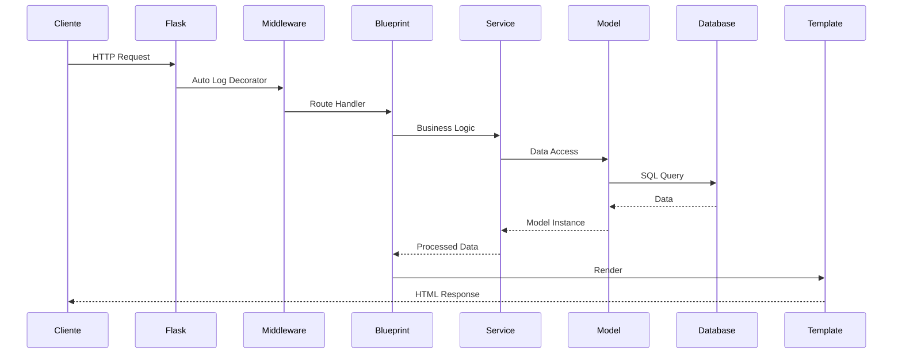

# 🏗️ Arquitetura do Sistema

**Última Atualização:** 18/10/2025  
**Versão:** 1.0  
**Status:** ✅ Documentação Oficial

---

## 🎯 Visão Geral

O sistema segue uma **arquitetura modular baseada em Blueprints do Flask**, com separação clara de responsabilidades.

### Princípios Arquiteturais

1. **Modularidade** - Cada módulo é independente e pode ser desabilitado
2. **Separação de Responsabilidades** - Models, Services, APIs separados
3. **Reutilização** - Serviços compartilhados entre módulos
4. **Testabilidade** - Componentes testáveis isoladamente
5. **Escalabilidade** - Fácil adicionar novos módulos

---

## 📁 Estrutura de Diretórios

```
app30/
├── app_pev.py                 # Aplicação principal Flask
├── config.py                  # Configurações globais
├── config_database.py         # Abstração de banco de dados
│
├── models/                    # Modelos de dados (SQLAlchemy)
│   ├── __init__.py           # DB instance + LoginManager
│   ├── user.py               # Modelo de usuário
│   ├── company.py            # Modelo de empresa
│   └── ...
│
├── modules/                   # Módulos de negócio (Blueprints)
│   ├── pev/                  # Planejamento Estratégico Versus
│   │   └── __init__.py       # Blueprint + rotas
│   ├── grv/                  # Gestão de Resultados Versus
│   │   └── __init__.py
│   └── meetings/             # Sistema de Reuniões
│       └── __init__.py
│
├── services/                  # Serviços compartilhados
│   ├── auth_service.py       # Autenticação e autorização
│   ├── log_service.py        # Logging e auditoria
│   ├── ai_service.py         # Integração IA
│   ├── email_service.py      # Envio de emails
│   └── ...
│
├── middleware/                # Middlewares e decorators
│   └── auto_log_decorator.py # Log automático de CRUD
│
├── api/                       # APIs REST dedicadas
│   └── auth.py               # API de autenticação
│
├── database/                  # Helpers de banco de dados
│   ├── postgres_helper.py    # Funções PostgreSQL
│   └── sqlite_db.py          # Funções SQLite
│
├── templates/                 # Templates Jinja2
│   ├── base.html             # Template base
│   ├── login.html            # Páginas públicas
│   ├── dashboard.html        # Páginas protegidas
│   └── ...
│
├── static/                    # Arquivos estáticos
│   ├── css/
│   ├── js/
│   └── images/
│
├── utils/                     # Utilitários compartilhados
│   └── project_activity_utils.py
│
├── tests/                     # Testes automatizados
│   └── ...
│
└── docs/                      # Documentação
    └── governance/            # Governança técnica
```

---

## 🔄 Fluxo de Requisições

### 1. Requisição HTTP

```
Cliente → app_pev.py → Middleware → Blueprint → Service → Model → Database
                                         ↓
                                    Template ← Response
```

### 2. Fluxo Detalhado



---

## 🧩 Camadas da Aplicação

### Layer 1: Apresentação (Templates)

**Responsabilidade:** UI e renderização

```
templates/
  ├── base.html              # Layout master
  ├── components/            # Componentes reutilizáveis
  └── [module]/              # Templates por módulo
```

**Regras:**
- ✅ Apenas lógica de apresentação
- ✅ Usar `` para componentes
- ❌ Nunca consultar banco direto
- ❌ Nunca lógica de negócio

### Layer 2: Rotas (Blueprints)

**Responsabilidade:** Roteamento e validação de entrada

```python
# modules/grv/__init__.py
@grv_bp.route('/api/company/<int:company_id>/projects', methods=['POST'])
@login_required
@auto_log_crud('project')
def create_project(company_id):
    # 1. Validar entrada
    data = request.json
    
    # 2. Chamar serviço
    result = project_service.create(company_id, data)
    
    # 3. Retornar resposta
    return jsonify({'success': True, 'data': result})
```

**Regras:**
- ✅ Validação de entrada
- ✅ Chamar services para lógica
- ✅ Formatar resposta
- ❌ Nunca acessar models diretamente
- ❌ Nunca lógica complexa

### Layer 3: Serviços (Services)

**Responsabilidade:** Lógica de negócio

```python
# services/project_service.py
class ProjectService:
    def create(self, company_id, data):
        # Validações de negócio
        if not self._can_create_project(company_id):
            raise BusinessException("Limite atingido")
        
        # Criar projeto
        project = Project(**data)
        db.session.add(project)
        db.session.commit()
        
        # Ações adicionais (emails, notificações)
        self._notify_team(project)
        
        return project
```

**Regras:**
- ✅ Validações de negócio
- ✅ Orquestração de models
- ✅ Transações complexas
- ❌ Nunca acessar request diretamente
- ❌ Nunca renderizar templates

### Layer 4: Modelos (Models)

**Responsabilidade:** Estrutura de dados e persistência

```python
# models/project.py
class Project(db.Model):
    __tablename__ = 'projects'
    
    id = db.Column(db.Integer, primary_key=True)
    name = db.Column(db.String(200), nullable=False)
    company_id = db.Column(db.Integer, db.ForeignKey('companies.id'))
    
    # Relacionamentos
    company = db.relationship('Company', backref='projects')
    
    # Métodos de instância (lógica simples)
    def to_dict(self):
        return {
            'id': self.id,
            'name': self.name,
            'company_id': self.company_id
        }
```

**Regras:**
- ✅ Definição de schema
- ✅ Relacionamentos
- ✅ Métodos de serialização simples
- ❌ Nunca lógica de negócio complexa
- ❌ Nunca acessar outros serviços

### Layer 5: Banco de Dados

**Responsabilidade:** Persistência

- PostgreSQL (produção)
- SQLite (desenvolvimento)

---

## 🎯 Padrões de Módulos (Blueprints)

### Estrutura de um Blueprint

```python
# modules/[nome]/__init__.py
from flask import Blueprint, request, jsonify
from flask_login import login_required

# Criar blueprint
[nome]_bp = Blueprint('[nome]', __name__, url_prefix='/[nome]')

# Rotas
@[nome]_bp.route('/')
@login_required
def index():
    return render_template('[nome]/index.html')

@[nome]_bp.route('/api/<int:id>', methods=['GET', 'POST', 'PUT', 'DELETE'])
@login_required
def api_handler(id):
    # Implementação
    pass
```

### Checklist para Novo Módulo

- [ ] Criar diretório em `modules/[nome]/`
- [ ] Criar `__init__.py` com blueprint
- [ ] Registrar blueprint em `app_pev.py`
- [ ] Criar templates em `templates/[nome]/`
- [ ] Criar models em `models/[nome].py`
- [ ] Criar service se necessário
- [ ] Adicionar testes em `tests/[nome]/`
- [ ] Documentar em `docs/`

---

## 🔐 Sistema de Autenticação

### Fluxo de Login

```
1. POST /login (credenciais)
2. auth_service.authenticate_user()
3. Flask-Login cria sessão
4. Redirect para /dashboard
```

### Proteção de Rotas

```python
# Rota protegida simples
@app.route('/dashboard')
@login_required
def dashboard():
    return render_template('dashboard.html')

# Rota protegida com role
@app.route('/admin')
@login_required
def admin():
    if not current_user.is_admin:
        abort(403)
    return render_template('admin.html')
```

### Middleware de Log Automático

```python
# Decorador para log automático
@auto_log_crud('entity_type')
def route_handler():
    # Automaticamente:
    # - Registra ação (CREATE/UPDATE/DELETE)
    # - Captura old/new values
    # - Salva em user_logs
    pass
```

---

## 📊 Sistema de Logging e Auditoria

### Níveis de Log

1. **System Logs** - Erros e eventos do sistema
2. **User Logs** - Ações de usuários (CRUD)
3. **Route Audit** - Cobertura de logging em rotas

### Como Adicionar Log em Nova Rota

```python
from middleware.auto_log_decorator import auto_log_crud

@grv_bp.route('/api/projects', methods=['POST'])
@login_required
@auto_log_crud('project')  # ← Adicionar esta linha
def create_project():
    # Seu código aqui
    return jsonify(result)
```

---

## 🗄️ Estratégia de Banco de Dados

### Dual Database Support

O sistema suporta PostgreSQL e SQLite simultaneamente.

```python
# config_database.py
def get_db():
    """Retorna conexão para o banco configurado"""
    if db_config['type'] == 'postgresql':
        return pg_connect()
    else:
        return sqlite_connect()
```

### Regras de Compatibilidade

```python
# ✅ BOM - Compatível com ambos
Column(String(100))
Column(Integer)
Column(Text)
Column(JSON)
Column(DateTime)

# ❌ RUIM - Específico de PostgreSQL
Column(JSONB)
Column(ARRAY)
Column(UUID)
```

### Migrations

```bash
# Criar migration
flask db migrate -m "descrição"

# Aplicar migration
flask db upgrade

# Reverter migration
flask db downgrade
```

---

## 🔄 Integração de Novos Módulos

### Processo de Adição

1. **Criar estrutura**
   ```bash
   mkdir modules/novo_modulo
   touch modules/novo_modulo/__init__.py
   ```

2. **Definir blueprint**
   ```python
   from flask import Blueprint
   novo_bp = Blueprint('novo', __name__, url_prefix='/novo')
   ```

3. **Registrar em app_pev.py**
   ```python
   from modules.novo_modulo import novo_bp
   app.register_blueprint(novo_bp)
   ```

4. **Criar templates**
   ```bash
   mkdir templates/novo_modulo
   ```

5. **Adicionar testes**
   ```bash
   mkdir tests/novo_modulo
   ```

---

## 🎨 Padrões de Response

### Sucesso (200)

```json
{
  "success": true,
  "data": {
    "id": 1,
    "name": "Projeto X"
  }
}
```

### Erro (400/500)

```json
{
  "success": false,
  "error": "Mensagem de erro",
  "details": {}  // opcional
}
```

### Lista (200)

```json
{
  "success": true,
  "data": [...],
  "total": 100,
  "page": 1,
  "per_page": 20
}
```

---

## 🔍 Observabilidade

### Onde Ver Logs

- **Console:** Logs em tempo real durante desenvolvimento
- **Route Audit:** `/configs/system/audit` - Cobertura de logs
- **User Logs:** `/logs/` - Ações de usuários
- **Database:** Tabela `user_logs`

### Métricas Importantes

- Cobertura de logging em rotas CRUD
- Tempo de resposta de rotas
- Erros de autenticação
- Uso de recursos (via logs)

---

## 🚀 Performance

### Otimizações Implementadas

1. **Eager Loading:** `db.relationship(..., lazy='joined')`
2. **Indexação:** Campos frequentemente consultados
3. **Cache:** Flask-Caching em rotas estáticas
4. **Pagination:** Sempre paginar listas grandes

### Anti-Patterns a Evitar

```python
# ❌ N+1 Query Problem
for project in projects:
    print(project.company.name)  # Query adicional!

# ✅ Eager Loading
projects = Project.query.options(
    db.joinedload(Project.company)
).all()
```

---

## 📚 Referências

- **Flask Blueprints:** https://flask.palletsprojects.com/blueprints/
- **SQLAlchemy ORM:** https://docs.sqlalchemy.org/orm/
- **Flask-Login:** https://flask-login.readthedocs.io/

---

## 📝 Histórico de Mudanças

| Data | Mudança | Autor |
|------|---------|-------|
| 18/10/2025 | Criação inicial | Tech Team |

---

**Próxima revisão:** Trimestral  
**Responsável:** Arquiteto de Software


